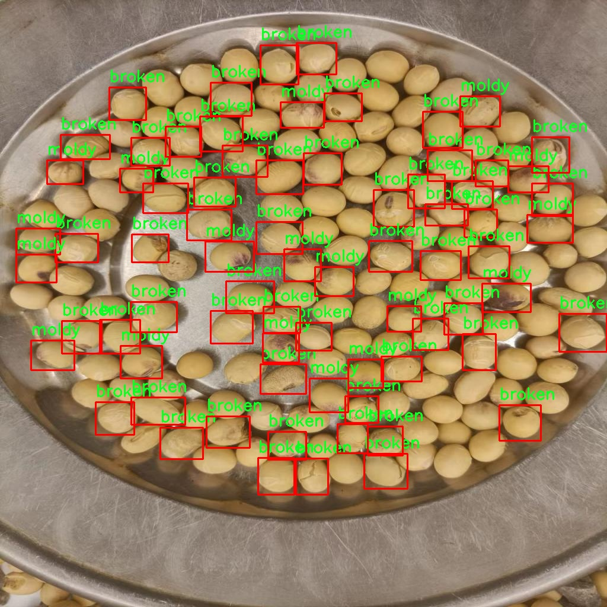

### 1.背景意义

研究背景与意义

随着全球对食品安全和质量的日益关注，农业产品的品质检测成为了一个重要的研究领域。大豆作为一种重要的农作物，广泛应用于食品、饲料和工业原料中，其品质直接影响到消费者的健康和市场的经济效益。传统的大豆品质检测方法往往依赖人工目测和简单的物理检验，这不仅效率低下，而且容易受到人为因素的影响，导致检测结果的不准确。因此，开发一种高效、准确的自动化检测系统显得尤为重要。

近年来，计算机视觉技术的快速发展为大豆品质检测提供了新的解决方案。基于深度学习的目标检测算法，尤其是YOLO（You Only Look Once）系列算法，因其高效性和实时性而受到广泛关注。YOLOv11作为该系列的最新版本，具有更强的特征提取能力和更快的处理速度，能够在复杂的环境中实现高精度的目标检测。通过对大豆品质进行分类，如良品、破损、杂质和霉变等，YOLOv11能够为农产品的质量控制提供可靠的数据支持。

本研究旨在基于改进的YOLOv11算法，构建一个高效的大豆品质检测系统。该系统将利用一个包含172张图像的数据集，涵盖了四种大豆品质类别，分别为破损、良品、杂质和霉变。通过对数据集的深度学习训练，系统将能够自动识别和分类不同品质的大豆，从而提高检测的准确性和效率。此外，系统的实现将为农业生产者提供实时的质量反馈，帮助他们在生产过程中做出更为科学的决策，进而提升大豆的市场竞争力。

综上所述，基于改进YOLOv11的大豆品质检测系统不仅具有重要的理论意义，还有助于推动农业现代化进程，保障食品安全，促进经济发展。

### 2.视频效果

[2.1 视频效果](https://www.bilibili.com/video/BV1rim8Y2ETv/)

### 3.图片效果


##### [项目涉及的源码数据来源链接](https://kdocs.cn/l/cszuIiCKVNis)**

注意：本项目提供训练的数据集和训练教程,由于版本持续更新,暂不提供权重文件（best.pt）,请按照6.训练教程进行训练后实现上图演示的效果。

### 4.数据集信息

##### 4.1 本项目数据集类别数＆类别名

nc: 4
names: ['broken', 'good', 'impurity', 'moldy']


该项目为【目标检测】数据集，请在【训练教程和Web端加载模型教程（第三步）】这一步的时候按照【目标检测】部分的教程来训练

##### 4.2 本项目数据集信息介绍

本项目数据集信息介绍

本项目所使用的数据集专注于大豆品质检测，旨在为改进YOLOv11模型提供高质量的训练数据，以实现对大豆优良、残缺等品质的精准识别。数据集中包含四个主要类别，分别为“broken”（残缺）、“good”（优良）、“impurity”（杂质）和“moldy”（霉变），这些类别涵盖了大豆在实际生产和储存过程中可能出现的各种品质问题。通过对这些类别的细致划分，数据集能够有效支持模型在不同品质特征下的学习与识别。

在数据集的构建过程中，我们注重数据的多样性和代表性，确保每个类别都包含了丰富的样本，以便模型能够在训练中充分学习到各类大豆的特征。例如，残缺大豆样本可能包括不同程度的破损，优良大豆则展现出其饱满和健康的特征，而杂质和霉变大豆则分别代表了外部污染和生物腐败的风险。这种多样化的样本选择不仅提高了模型的鲁棒性，也增强了其在实际应用中的适应能力。

此外，数据集的标注工作严格遵循行业标准，确保每个样本的标签准确无误。通过高质量的标注，模型能够更好地理解不同类别之间的细微差别，从而提升检测的准确性和效率。总之，本项目的数据集为大豆品质检测系统的开发提供了坚实的基础，助力于实现对大豆品质的智能化监测与评估，推动农业生产的现代化进程。




### 5.全套项目环境部署视频教程（零基础手把手教学）

[5.1 所需软件PyCharm和Anaconda安装教程（第一步）](https://www.bilibili.com/video/BV1BoC1YCEKi/?spm_id_from=333.999.0.0&vd_source=bc9aec86d164b67a7004b996143742dc)


[5.2 安装Python虚拟环境创建和依赖库安装视频教程（第二步）](https://www.bilibili.com/video/BV1ZoC1YCEBw?spm_id_from=333.788.videopod.sections&vd_source=bc9aec86d164b67a7004b996143742dc)

### 6.改进YOLOv11训练教程和Web_UI前端加载模型教程（零基础手把手教学）

[6.1 改进YOLOv11训练教程和Web_UI前端加载模型教程（第三步）](https://www.bilibili.com/video/BV1BoC1YCEhR?spm_id_from=333.788.videopod.sections&vd_source=bc9aec86d164b67a7004b996143742dc)


按照上面的训练视频教程链接加载项目提供的数据集，运行train.py即可开始训练



     Epoch   gpu_mem       box       obj       cls    labels  img_size
     1/200     20.8G   0.01576   0.01955  0.007536        22      1280: 100%|██████████| 849/849 [14:42<00:00,  1.04s/it]
               Class     Images     Labels          P          R     mAP@.5 mAP@.5:.95: 100%|██████████| 213/213 [01:14<00:00,  2.87it/s]
                 all       3395      17314      0.994      0.957      0.0957      0.0843

     Epoch   gpu_mem       box       obj       cls    labels  img_size
     2/200     20.8G   0.01578   0.01923  0.007006        22      1280: 100%|██████████| 849/849 [14:44<00:00,  1.04s/it]
               Class     Images     Labels          P          R     mAP@.5 mAP@.5:.95: 100%|██████████| 213/213 [01:12<00:00,  2.95it/s]
                 all       3395      17314      0.996      0.956      0.0957      0.0845

     Epoch   gpu_mem       box       obj       cls    labels  img_size
     3/200     20.8G   0.01561    0.0191  0.006895        27      1280: 100%|██████████| 849/849 [10:56<00:00,  1.29it/s]
               Class     Images     Labels          P          R     mAP@.5 mAP@.5:.95: 100%|███████   | 187/213 [00:52<00:00,  4.04it/s]
                 all       3395      17314      0.996      0.957      0.0957      0.0845


###### [项目数据集下载链接](https://kdocs.cn/l/cszuIiCKVNis)

### 7.原始YOLOv11算法讲解


YOLO11 是 Ultralytics YOLO 系列的最新版本，结合了尖端的准确性、速度和效率，用于目标检测、分割、分类、定向边界框和姿态估计。与
YOLOv8 相比，它具有更少的参数和更好的结果，不难预见，YOLO11 在边缘设备上更高效、更快，将频繁出现在计算机视觉领域的最先进技术（SOTA）中。


**主要特点**

  * **增强的特征提取：**YOLO11 使用改进的主干和颈部架构来增强特征提取，以实现更精确的目标检测和复杂任务的性能。

  * **针对效率和速度优化：**精细的架构设计和优化的训练流程在保持准确性和性能之间最佳平衡的同时，提供更快的处理速度。

  * **更少的参数，更高的准确度：**YOLO11m 在 COCO 数据集上实现了比 YOLOv8m 更高的 mAP，参数减少了 22%，提高了计算效率，同时不牺牲准确度。

  * **跨环境的适应性：**YOLO11 可以无缝部署在边缘设备、云平台和配备 NVIDIA GPU 的系统上，确保最大的灵活性。

  * **支持广泛的任务范围：**YOLO11 支持各种计算机视觉任务，如目标检测、实例分割、图像分类、姿态估计和定向目标检测（OBB）。


### 8.200+种全套改进YOLOV11创新点原理讲解

#### 8.1 200+种全套改进YOLOV11创新点原理讲解大全

由于篇幅限制，每个创新点的具体原理讲解就不全部展开，具体见下列网址中的改进模块对应项目的技术原理博客网址【Blog】（创新点均为模块化搭建，原理适配YOLOv5~YOLOv11等各种版本）

[改进模块技术原理博客【Blog】网址链接](https://gitee.com/qunmasj/good)


#### 8.2 精选部分改进YOLOV11创新点原理讲解

###### 这里节选部分改进创新点展开原理讲解(完整的改进原理见上图和[改进模块技术原理博客链接](https://gitee.com/qunmasj/good)【如果此小节的图加载失败可以通过CSDN或者Github搜索该博客的标题访问原始博客，原始博客图片显示正常】
### 可变性卷积DCN简介
卷积神经网络由于其构建模块中固定的几何结构，本质上受限于模型几何变换。为了提高卷积神经网络的转换建模能力，《Deformable Convolutional Networks》作者提出了两个模块：可变形卷积（deformable convolution）和可变形RoI池（deformable RoI pooling）。这两个模块均基于用额外的偏移来增加模块中的空间采样位置以及从目标任务中学习偏移的思想，而不需要额外的监督。

第一次证明了在深度神经网络中学习密集空间变换（dense spatial transformation）对于复杂的视觉任务是有效的

视觉识别中的一个关键挑战是如何适应对象比例、姿态、视点和零件变形中的几何变化或模型几何变换。一般有两种方法实现：
1）建立具有足够期望变化的训练数据集。这通常通过增加现有的数据样本来实现，例如通过仿射变换。但是训练成本昂贵而且模型参数庞大。
2）使用变换不变（transformation-invariant）的特征和算法。比如比较有名的SIFT(尺度不变特征变换)便是这一类的代表算法。

但以上的方法有两个缺点：
1）几何变换被假定为固定的和已知的，这些先验知识被用来扩充数据，设计特征和算法。为此，这个假设阻止了对具有未知几何变换的新任务的推广，从而导致这些几何变换可能没有被正确建模。
2）对于不变特征和算法进行手动设计，对于过于复杂的变换可能是困难的或不可行的。

卷积神经网络本质上局限于模拟大型未知转换。局限性源于CNN模块的固定几何结构：卷积单元在固定位置对输入特征图进行采样；池化层以固定比率降低特征矩阵分辨率；RoI（感兴趣区域）池化层将RoI分成固定的空间箱（spatial bins）等。缺乏处理几何变换的内部机制。

这种内部机制的缺乏会导致一些问题，举个例子。同一个CNN层中所有激活单元的感受野大小是相同的，但是这是不可取的。因为不同的位置可能对应于具有不同尺度或变形的对象，所以尺度或感受野大小的自适应确定对于具有精细定位的视觉识别是渴望的。

对于这些问题，作者提出了两个模块提高CNNs对几何变换建模的能力。


deformable convolution（可变形卷积）
将2D偏移量添加到标准卷积中的常规网格采样位置，使得采样网格能够自由变形。通过额外的卷积层，从前面的特征映射中学习偏移。因此，变形采用局部、密集和自适应的方式取决于输入特征。


deformable RoI pooling（可变形RoI池化）
为先前RoI池化的常规库（bin）分区中的每个库位置（bin partition）增加了一个偏移量。类似地，偏移是从前面的特征图和感兴趣区域中学习的，从而能够对具有不同形状的对象进行自适应部件定位（adaptive part localization）。

#### Deformable Convolutional Networks
Deformable Convolution
2D卷积由两个步骤组成：
1）在输入特征图x xx上使用规则网格R RR进行采样。
2）把这些采样点乘不同权重w ww后相加。

网格R定义感受野大小和扩张程度，比如内核大小为3x3，扩张程度为1的网格R可以表示为：
R = { ( − 1 , − 1 ) , ( − 1 , 0 ) , … , ( 0 , 1 ) , ( 1 , 1 ) } R = \{(-1,-1),(-1,0),\dots,(0,1),(1,1)\}
R={(−1,−1),(−1,0),…,(0,1),(1,1)}

​
 一般为小数，使用双线性插值进行处理。（把小数坐标分解到相邻的四个整数坐标点来计算结果）


具体操作如图所示：


首先对输入特征层进行一个普通的3x3卷积处理得到偏移域（offset field）。偏移域特征图具有与输入特征图相同的空间分辨率，channels维度2N对应于N个2D（xy两个方向）偏移。其中的N是原输入特征图上所具有的N个channels，也就是输入输出channels保持不变，这里xy两个channels分别对输出特征图上的一个channels进行偏移。确定采样点后就通过与相对应的权重w点乘相加得到输出特征图上该点最终值。

前面也提到过，由于这里xy两个方向所训练出来的偏移量一般来说是一个小数，那么为了得到这个点所对应的数值，会采用双线性插值的方法，从最近的四个邻近坐标点中计算得到该偏移点的数值，公式如下：


具体推理过程见：双线性插值原理

#### Deformable RoI Poolingb
所有基于区域提议（RPN）的对象检测方法都使用RoI池话处理，将任意大小的输入矩形区域转换为固定大小的特征图。


 一般为小数，需要使用双线性插值进行处理。


具体操作如图所示：


当时看这个部分的时候觉得有些突兀，明明RoI池化会将特征层转化为固定尺寸的区域。其实，我个人觉得，这个部分与上述的可变性卷积操作是类似的。这里同样是使用了一个普通的RoI池化操作，进行一些列处理后得到了一个偏移域特征图，然后重新作用于原来的w × H w \times Hw×H的RoI。只不过这里不再是规律的逐行逐列对每个格子进行池化，而是对于格子进行偏移后再池化处理。

#### Postion﹣Sensitive RoI Pooling
除此之外，论文还提出一种PS RoI池化（Postion﹣Sensitive RoI Pooling）。不同于上述可变形RoI池化中的全连接过程，这里使用全卷积替换。

具体操作如图所示：


首先，对于原来的特征图来说，原本是将输入特征图上的RoI区域分成k × k k\times kk×k个bin。而在这里，则是将输入特征图进行卷积操作，分别得到一个channels为k 2 ( C + 1 ) k^{2}(C+1)k (C+1)的得分图（score maps）和一个channels为2 k 2 ( C + 1 ) 2k{2}(C+1)2k 2 (C+1)的偏移域（offset fields），这两个特征矩阵的宽高是与输入特征矩阵相同的。其中，得分图的channels中，k × k k \times kk×k分别表示的是每一个网格，C CC表示的检测对象的类别数目，1表示背景。而在偏移域中的2表示xy两个方向的偏移。
也就是说，在PS RoI池化中，对于RoI的每一个网格都独自占一个通道形成一层得分图，然后其对于的偏移量占两个通道。offset fields得到的偏移是归一化后的偏移，需要通过和deformable RoI pooling中一样的变换方式得到∆ p i j ∆p_{ij}∆p ij，然后对每层得分图进行偏移池化处理。最后处理完的结果就对应着最后输出的一个网格。所以其包含了位置信息。

原文论述为：


#### Understanding Deformable ConvNets
当可变形卷积叠加时，复合变形的效果是深远的。如图所示：


ps：a是标准卷积的固定感受野，b是可变形卷积的适应性感受野。

感受野和标准卷积中的采样位置在整个顶部特征图上是固定的(左)。在可变形卷积中，它们根据对象的比例和形状进行自适应调整(右)。


### 9.系统功能展示

图9.1.系统支持检测结果表格显示

  图9.2.系统支持置信度和IOU阈值手动调节

  图9.3.系统支持自定义加载权重文件best.pt(需要你通过步骤5中训练获得)

  图9.4.系统支持摄像头实时识别

  图9.5.系统支持图片识别

  图9.6.系统支持视频识别

  图9.7.系统支持识别结果文件自动保存

  图9.8.系统支持Excel导出检测结果数据


### 10. YOLOv11核心改进源码讲解

#### 10.1 CSwomTramsformer.py

以下是对代码中最核心部分的提取和详细注释：

```python
import torch
import torch.nn as nn
import numpy as np

class Mlp(nn.Module):
    """多层感知机（MLP）模块"""
    def __init__(self, in_features, hidden_features=None, out_features=None, act_layer=nn.GELU, drop=0.):
        super().__init__()
        out_features = out_features or in_features  # 输出特征数
        hidden_features = hidden_features or in_features  # 隐藏层特征数
        self.fc1 = nn.Linear(in_features, hidden_features)  # 第一层线性变换
        self.act = act_layer()  # 激活函数
        self.fc2 = nn.Linear(hidden_features, out_features)  # 第二层线性变换
        self.drop = nn.Dropout(drop)  # Dropout层

    def forward(self, x):
        """前向传播"""
        x = self.fc1(x)  # 线性变换
        x = self.act(x)  # 激活
        x = self.drop(x)  # Dropout
        x = self.fc2(x)  # 线性变换
        x = self.drop(x)  # Dropout
        return x

class LePEAttention(nn.Module):
    """局部增强注意力模块"""
    def __init__(self, dim, resolution, idx, split_size=7, num_heads=8, attn_drop=0.):
        super().__init__()
        self.dim = dim  # 输入特征维度
        self.resolution = resolution  # 输入分辨率
        self.split_size = split_size  # 切分大小
        self.num_heads = num_heads  # 注意力头数
        head_dim = dim // num_heads  # 每个头的维度
        self.scale = head_dim ** -0.5  # 缩放因子
        self.get_v = nn.Conv2d(dim, dim, kernel_size=3, stride=1, padding=1, groups=dim)  # 用于计算v的卷积层
        self.attn_drop = nn.Dropout(attn_drop)  # 注意力Dropout

    def im2cswin(self, x):
        """将输入转换为窗口形式"""
        B, N, C = x.shape
        H = W = int(np.sqrt(N))  # 计算高度和宽度
        x = x.transpose(-2, -1).contiguous().view(B, C, H, W)  # 转换形状
        x = img2windows(x, self.split_size, self.split_size)  # 切分为窗口
        return x

    def forward(self, qkv):
        """前向传播"""
        q, k, v = qkv  # 分别获取q, k, v
        q = self.im2cswin(q)  # 将q转换为窗口形式
        k = self.im2cswin(k)  # 将k转换为窗口形式
        v = self.get_v(v)  # 计算v
        q = q * self.scale  # 缩放q
        attn = (q @ k.transpose(-2, -1))  # 计算注意力权重
        attn = nn.functional.softmax(attn, dim=-1)  # softmax归一化
        attn = self.attn_drop(attn)  # 应用Dropout
        x = attn @ v  # 加权求和
        return x

class CSWinBlock(nn.Module):
    """CSWin Transformer的基本块"""
    def __init__(self, dim, num_heads, split_size=7):
        super().__init__()
        self.dim = dim  # 输入特征维度
        self.num_heads = num_heads  # 注意力头数
        self.qkv = nn.Linear(dim, dim * 3)  # 线性层用于生成q, k, v
        self.attn = LePEAttention(dim, resolution=split_size, idx=0, num_heads=num_heads)  # 注意力模块
        self.mlp = Mlp(in_features=dim, hidden_features=dim * 4)  # MLP模块

    def forward(self, x):
        """前向传播"""
        qkv = self.qkv(x).reshape(x.shape[0], -1, 3, self.dim).permute(2, 0, 1, 3)  # 生成qkv
        x = self.attn(qkv)  # 计算注意力
        x = x + self.mlp(x)  # 加上MLP的输出
        return x

class CSWinTransformer(nn.Module):
    """CSWin Transformer模型"""
    def __init__(self, img_size=640, in_chans=3, num_classes=1000):
        super().__init__()
        self.stage1_conv_embed = nn.Conv2d(in_chans, 96, kernel_size=7, stride=4, padding=3)  # 输入卷积层
        self.stage1 = CSWinBlock(dim=96, num_heads=12)  # 第一阶段的CSWinBlock

    def forward(self, x):
        """前向传播"""
        x = self.stage1_conv_embed(x)  # 卷积嵌入
        x = self.stage1(x)  # 通过CSWinBlock
        return x

# 示例代码：创建模型并进行前向传播
if __name__ == '__main__':
    inputs = torch.randn((1, 3, 640, 640))  # 随机输入
    model = CSWinTransformer()  # 创建模型
    res = model(inputs)  # 前向传播
    print(res.size())  # 输出结果的尺寸
```

### 代码说明：
1. **Mlp类**：实现了一个简单的多层感知机，包括两个线性层和激活函数，支持Dropout。
2. **LePEAttention类**：实现了局部增强注意力机制，包含输入的转换、注意力计算和输出。
3. **CSWinBlock类**：构建了CSWin Transformer的基本模块，包含了注意力机制和MLP。
4. **CSWinTransformer类**：定义了整个模型的结构，包括输入卷积层和多个CSWinBlock的堆叠。
5. **主程序**：示例代码用于创建模型并进行前向传播，输出结果的尺寸。

这些核心部分是CSWin Transformer模型的基础，提供了模型的主要功能和结构。

该文件实现了一个名为CSWin Transformer的视觉变换器模型，主要用于图像分类任务。该模型由多个模块组成，包括卷积嵌入、CSWin块、合并块等，具有较强的特征提取能力。文件开头包含版权信息和必要的库导入，包括PyTorch、timm库和einops库等。

首先定义了一个多层感知机（Mlp）类，该类包含两个线性层和一个激活函数（默认为GELU），并在每个线性层后添加了Dropout层以防止过拟合。接下来定义了LePEAttention类，该类实现了一种新的注意力机制，利用局部增强位置编码（LePE）来增强模型对局部特征的捕捉能力。该类的核心功能包括将输入图像转换为窗口格式、计算注意力权重以及将注意力应用于值向量。

CSWinBlock类是CSWin Transformer的基本构建块，包含了多头注意力机制和前馈网络。它根据输入的分辨率和特征维度构建多个LePEAttention实例，并在前向传播中进行特征提取和融合。

文件中还定义了img2windows和windows2img函数，用于将图像转换为窗口格式以及将窗口格式的特征重构为图像格式。Merge_Block类用于在不同阶段之间进行特征的合并和降维。

CSWinTransformer类是整个模型的主体，初始化时设置了输入图像的大小、补丁大小、通道数、类别数、嵌入维度、深度、分割大小等参数。模型的前向传播过程通过多个阶段的卷积嵌入、CSWin块和合并块来提取图像特征，并返回特征图。

文件中还包含了用于加载预训练权重的函数，以及不同规模的CSWin模型（tiny、small、base、large）的构造函数。每个模型都可以选择加载预训练的权重，以便在特定任务上进行微调。

最后，文件的主程序部分展示了如何实例化不同规模的CSWin模型，并对随机生成的输入进行前向传播，输出每个模型的特征图尺寸。这部分代码可以用于验证模型的构建是否正确，以及在实际应用中如何使用这些模型。

#### 10.2 attention.py

以下是代码中最核心的部分，并附上详细的中文注释：

```python
import torch
from torch import nn

class EMA(nn.Module):
    """
    EMA (Exponential Moving Average) 模块
    用于对输入特征进行加权平均以增强特征表示。
    """
    def __init__(self, channels, factor=8):
        super(EMA, self).__init__()
        self.groups = factor  # 将通道分为多个组
        assert channels // self.groups > 0  # 确保每组至少有一个通道
        self.softmax = nn.Softmax(-1)  # Softmax 层
        self.agp = nn.AdaptiveAvgPool2d((1, 1))  # 自适应平均池化
        self.pool_h = nn.AdaptiveAvgPool2d((None, 1))  # 针对高度的池化
        self.pool_w = nn.AdaptiveAvgPool2d((1, None))  # 针对宽度的池化
        self.gn = nn.GroupNorm(channels // self.groups, channels // self.groups)  # 组归一化
        self.conv1x1 = nn.Conv2d(channels // self.groups, channels // self.groups, kernel_size=1)  # 1x1 卷积
        self.conv3x3 = nn.Conv2d(channels // self.groups, channels // self.groups, kernel_size=3, padding=1)  # 3x3 卷积

    def forward(self, x):
        b, c, h, w = x.size()  # 获取输入的批次大小、通道数、高度和宽度
        group_x = x.reshape(b * self.groups, -1, h, w)  # 将输入重塑为 (b*g, c//g, h, w)
        x_h = self.pool_h(group_x)  # 对每组进行高度池化
        x_w = self.pool_w(group_x).permute(0, 1, 3, 2)  # 对每组进行宽度池化并转置
        hw = self.conv1x1(torch.cat([x_h, x_w], dim=2))  # 1x1 卷积
        x_h, x_w = torch.split(hw, [h, w], dim=2)  # 将结果分为高度和宽度部分
        x1 = self.gn(group_x * x_h.sigmoid() * x_w.permute(0, 1, 3, 2).sigmoid())  # 组归一化
        x2 = self.conv3x3(group_x)  # 3x3 卷积
        x11 = self.softmax(self.agp(x1).reshape(b * self.groups, -1, 1).permute(0, 2, 1))  # 计算权重
        x12 = x2.reshape(b * self.groups, c // self.groups, -1)  # 重塑 x2
        x21 = self.softmax(self.agp(x2).reshape(b * self.groups, -1, 1).permute(0, 2, 1))  # 计算权重
        x22 = x1.reshape(b * self.groups, c // self.groups, -1)  # 重塑 x1
        weights = (torch.matmul(x11, x12) + torch.matmul(x21, x22)).reshape(b * self.groups, 1, h, w)  # 计算最终权重
        return (group_x * weights.sigmoid()).reshape(b, c, h, w)  # 返回加权后的结果

class SimAM(nn.Module):
    """
    SimAM (Similarity Attention Module) 模块
    用于计算输入特征的相似性并生成注意力权重。
    """
    def __init__(self, e_lambda=1e-4):
        super(SimAM, self).__init__()
        self.activaton = nn.Sigmoid()  # Sigmoid 激活函数
        self.e_lambda = e_lambda  # 正则化参数

    def forward(self, x):
        b, c, h, w = x.size()  # 获取输入的批次大小、通道数、高度和宽度
        n = w * h - 1  # 计算样本数
        x_minus_mu_square = (x - x.mean(dim=[2, 3], keepdim=True)).pow(2)  # 计算每个像素与均值的平方差
        y = x_minus_mu_square / (4 * (x_minus_mu_square.sum(dim=[2, 3], keepdim=True) / n + self.e_lambda)) + 0.5  # 计算注意力权重
        return x * self.activaton(y)  # 返回加权后的输入

class SpatialGroupEnhance(nn.Module):
    """
    Spatial Group Enhance 模块
    用于增强特征图的空间信息。
    """
    def __init__(self, groups=8):
        super().__init__()
        self.groups = groups  # 组数
        self.avg_pool = nn.AdaptiveAvgPool2d(1)  # 自适应平均池化
        self.weight = nn.Parameter(torch.zeros(1, groups, 1, 1))  # 权重参数
        self.bias = nn.Parameter(torch.zeros(1, groups, 1, 1))  # 偏置参数
        self.sig = nn.Sigmoid()  # Sigmoid 激活函数
        self.init_weights()  # 初始化权重

    def init_weights(self):
        for m in self.modules():
            if isinstance(m, nn.Conv2d):
                nn.init.kaiming_normal_(m.weight, mode='fan_out')  # Kaiming 正态初始化
                if m.bias is not None:
                    nn.init.constant_(m.bias, 0)  # 偏置初始化为0
            elif isinstance(m, nn.BatchNorm2d):
                nn.init.constant_(m.weight, 1)  # 批归一化权重初始化为1
                nn.init.constant_(m.bias, 0)  # 偏置初始化为0
            elif isinstance(m, nn.Linear):
                nn.init.normal_(m.weight, std=0.001)  # 线性层权重初始化
                if m.bias is not None:
                    nn.init.constant_(m.bias, 0)  # 偏置初始化为0

    def forward(self, x):
        b, c, h, w = x.shape  # 获取输入的批次大小、通道数、高度和宽度
        x = x.view(b * self.groups, -1, h, w)  # 重塑输入
        xn = x * self.avg_pool(x)  # 计算增强特征
        xn = xn.sum(dim=1, keepdim=True)  # 对每组求和
        t = xn.view(b * self.groups, -1)  # 重塑
        t = t - t.mean(dim=1, keepdim=True)  # 减去均值
        std = t.std(dim=1, keepdim=True) + 1e-5  # 计算标准差
        t = t / std  # 归一化
        t = t.view(b, self.groups, h, w)  # 重塑
        t = t * self.weight + self.bias  # 计算最终权重
        t = t.view(b * self.groups, 1, h, w)  # 重塑
        x = x * self.sig(t)  # 加权输入
        x = x.view(b, c, h, w)  # 返回原始形状
        return x
```

以上代码片段包含了三个核心模块：`EMA`、`SimAM` 和 `SpatialGroupEnhance`。每个模块都有其特定的功能和结构，适用于特征增强和注意力机制。每个类都包含了详细的中文注释，以帮助理解其功能和实现细节。

这个程序文件 `attention.py` 实现了一系列与注意力机制相关的深度学习模块，主要用于计算机视觉任务中的特征提取和增强。以下是对代码的详细说明：

首先，文件导入了必要的库，包括 PyTorch 和一些相关的模块。接着，定义了一些类和函数，这些类和函数实现了不同类型的注意力机制。

`EMA` 类实现了一种基于指数移动平均的注意力机制。它通过对输入特征进行分组、池化和卷积操作，生成加权的输出特征。`SimAM` 类实现了一种基于相似度的自适应注意力机制，使用 Sigmoid 激活函数来增强特征。

`SpatialGroupEnhance` 类则通过对输入特征进行空间增强，利用平均池化和卷积操作来生成空间权重，从而提升特征的表达能力。

`TopkRouting` 类实现了一种可微分的 Top-k 路由机制，用于选择最重要的特征。`KVGather` 类则用于根据路由索引选择键值对。

`QKVLinear` 类实现了查询、键和值的线性映射，`BiLevelRoutingAttention` 类实现了双层路由注意力机制，结合了全局和局部特征的提取。

`BiLevelRoutingAttention_nchw` 类是 `BiLevelRoutingAttention` 的 NCHW 格式实现，优化了输入格式以提高效率。

`CoordAtt`、`TripletAttention`、`BAMBlock`、`EfficientAttention` 等类实现了不同类型的注意力机制，旨在增强特征表示能力。

`LSKA` 类实现了大可分离卷积注意力机制，`SegNext_Attention` 类则是针对分割任务的注意力机制。

`FocusedLinearAttention` 类实现了一种聚焦线性注意力机制，结合了局部窗口的特征提取。

`MLCA` 和 `AFGCAttention` 类实现了多路径和自适应细粒度通道注意力机制，进一步增强了特征的表达能力。

最后，文件中还定义了一些辅助函数和类，例如 `img2windows` 和 `windows2img` 用于图像的窗口化处理，以及 `LayerNormProxy` 和 `Conv2d_BN` 用于实现归一化和卷积操作。

总体而言，这个文件提供了一套丰富的注意力机制实现，适用于各种计算机视觉任务，尤其是在特征提取和增强方面。每个类和函数都针对特定的需求和场景进行了优化，展示了深度学习中注意力机制的多样性和灵活性。

#### 10.3 block.py


这个 `block.py` 文件包含了多种深度学习模型中的模块和功能，主要用于构建神经网络的不同层和结构。文件中使用了 PyTorch 框架，以下是对文件中主要内容的逐步说明。

首先，文件导入了必要的库，包括 PyTorch 的核心库、神经网络模块、激活函数、卷积操作等。还引入了一些自定义模块，如 `Conv`、`DWConv`、`DSConv` 等，这些模块通常用于实现不同类型的卷积操作。

文件中定义了多个类，每个类代表一种特定的网络层或模块。以下是一些重要模块的概述：

1. **自适应填充函数 `autopad`**：用于根据卷积核大小和膨胀率自动计算填充量，以确保输出的空间维度与输入相同。

2. **激活函数类**：如 `swish`、`h_swish` 和 `h_sigmoid`，这些类实现了不同的激活函数，通常用于提高网络的非线性表达能力。

3. **动态卷积类 `DynamicConv`**：实现了一种动态卷积操作，可以根据输入特征的不同动态调整卷积核。

4. **注意力机制模块**：如 `ChannelAttention_HSFPN` 和 `PixelAttention_CGA`，这些模块通过计算输入特征的加权和来增强特征表示。

5. **多尺度卷积模块 `MSCB`**：实现了多尺度卷积操作，可以通过不同大小的卷积核提取多尺度特征。

6. **深度特征下采样模块 `DRFD`**：通过最大池化和卷积操作对特征进行下采样，以减少特征图的空间维度。

7. **注意力融合模块 `CGAFusion`**：结合通道注意力和空间注意力来增强特征融合的效果。

8. **不同类型的瓶颈模块**：如 `Bottleneck`、`Bottleneck_AKConv`、`Bottleneck_DCNV2` 等，这些模块通常用于构建残差网络的基本单元。

9. **上下文引导融合模块 `ContextGuideFusionModule`**：通过上下文信息来增强特征表示。

10. **各种变体的 C3 和 C3k 模块**：这些模块是网络的主要构建块，通常用于实现特定的网络架构，如 CSP、RepVGG、GhostConv 等。

11. **其他模块**：如 `SDFM`、`FMB`、`CSP_PMSFA` 等，这些模块实现了特定的功能，通常用于图像处理、特征融合等任务。

整个文件展示了如何使用 PyTorch 构建复杂的神经网络结构，并实现多种先进的特征提取和融合技术。每个模块都可以根据需要进行组合和扩展，以适应不同的任务和数据集。

#### 10.3 head.py

以下是经过简化和注释的核心代码部分，主要是 `Detect_DyHead` 类及其相关功能。这个类是 YOLOv8 检测模型的一个检测头，负责处理输入特征并输出预测的边界框和类别概率。

```python
import torch
import torch.nn as nn
import math

class Detect_DyHead(nn.Module):
    """YOLOv8 检测头，使用动态头（DyHead）进行目标检测。"""
    
    def __init__(self, nc=80, hidc=256, block_num=2, ch=()):
        """
        初始化检测头的参数。
        
        参数:
        nc (int): 类别数量。
        hidc (int): 隐藏层通道数。
        block_num (int): 动态头的块数量。
        ch (tuple): 输入特征图的通道数。
        """
        super().__init__()
        self.nc = nc  # 类别数量
        self.nl = len(ch)  # 检测层数量
        self.reg_max = 16  # DFL 通道数
        self.no = nc + self.reg_max * 4  # 每个锚点的输出数量
        self.stride = torch.zeros(self.nl)  # 构建时计算的步幅
        c2, c3 = max((16, ch[0] // 4, self.reg_max * 4)), max(ch[0], self.nc)  # 通道数

        # 定义卷积层
        self.conv = nn.ModuleList(nn.Sequential(Conv(x, hidc, 1)) for x in ch)
        self.dyhead = nn.Sequential(*[DyHeadBlock(hidc) for _ in range(block_num)])  # 动态头块
        self.cv2 = nn.ModuleList(
            nn.Sequential(Conv(hidc, c2, 3), Conv(c2, c2, 3), nn.Conv2d(c2, 4 * self.reg_max, 1)) for _ in ch
        )
        self.cv3 = nn.ModuleList(
            nn.Sequential(
                nn.Sequential(DWConv(hidc, x, 3), Conv(x, c3, 1)),
                nn.Sequential(DWConv(c3, c3, 3), Conv(c3, c3, 1)),
                nn.Conv2d(c3, self.nc, 1),
            )
            for x in ch
        )
        self.dfl = DFL(self.reg_max) if self.reg_max > 1 else nn.Identity()  # DFL 层

    def forward(self, x):
        """前向传播，返回预测的边界框和类别概率。"""
        for i in range(self.nl):
            x[i] = self.conv[i](x[i])  # 应用卷积层
        x = self.dyhead(x)  # 通过动态头处理特征图
        shape = x[0].shape  # 获取输出形状

        for i in range(self.nl):
            # 将 cv2 和 cv3 的输出连接起来
            x[i] = torch.cat((self.cv2[i](x[i]), self.cv3[i](x[i])), 1)

        if self.training:
            return x  # 如果在训练模式，返回中间结果

        # 动态生成锚点和步幅
        self.anchors, self.strides = (x.transpose(0, 1) for x in make_anchors(x, self.stride, 0.5))
        x_cat = torch.cat([xi.view(shape[0], self.no, -1) for xi in x], 2)  # 连接所有输出

        # 分割边界框和类别概率
        box, cls = x_cat.split((self.reg_max * 4, self.nc), 1)
        dbox = dist2bbox(self.dfl(box), self.anchors.unsqueeze(0), xywh=True, dim=1) * self.strides  # 解码边界框
        y = torch.cat((dbox, cls.sigmoid()), 1)  # 返回最终结果
        return y

    def bias_init(self):
        """初始化检测头的偏置，警告：需要步幅可用。"""
        for a, b, s in zip(self.cv2, self.cv3, self.stride):
            a[-1].bias.data[:] = 1.0  # 边界框偏置
            b[-1].bias.data[:self.nc] = math.log(5 / self.nc / (640 / s) ** 2)  # 类别偏置
```

### 代码说明：
1. **类的定义**：`Detect_DyHead` 类继承自 `nn.Module`，用于实现 YOLOv8 的检测头。
2. **初始化方法**：构造函数接受类别数量、隐藏层通道数、动态头块数量和输入通道数，并初始化相关层。
3. **前向传播**：`forward` 方法实现了特征图的处理，返回预测的边界框和类别概率。
4. **偏置初始化**：`bias_init` 方法用于初始化检测头的偏置，以提高模型的收敛速度。

此代码是 YOLOv8 检测模型的核心部分，负责处理输入特征并输出检测结果。

这个程序文件 `head.py` 是一个用于目标检测的深度学习模型的实现，主要基于 YOLOv8 架构。该文件包含多个类，每个类实现了不同的检测头，适用于不同的任务，如目标检测、实例分割、姿态估计等。以下是对代码的详细说明。

首先，文件导入了一些必要的库，包括 `torch` 和 `torch.nn`，这些库是 PyTorch 框架的核心组件，提供了构建和训练神经网络所需的功能。接着，文件定义了一些模块和工具函数，这些模块在后续的检测头实现中被引用。

在检测头的实现中，`Detect_DyHead` 类是一个主要的检测头，采用了动态头（DyHead）结构，支持多层次的特征输入。构造函数中定义了类别数、隐藏通道数、块的数量以及输入通道等参数。该类的 `forward` 方法负责处理输入数据，生成预测的边界框和类别概率。

接下来，文件中定义了多个继承自 `Detect_DyHead` 的类，如 `Detect_DyHeadWithDCNV3` 和 `Detect_DyHeadWithDCNV4`，这些类通过不同的卷积结构（如深度可分离卷积）扩展了基本的检测头。

`Detect_AFPN_P345` 和 `Detect_AFPN_P2345` 类实现了基于自适应特征金字塔网络（AFPN）的检测头，利用不同的特征层进行融合，以提高检测性能。

`Detect_Efficient` 类则实现了一个高效的检测头，旨在减少计算量和内存使用，适合在资源受限的环境中使用。

`DetectAux` 类引入了辅助头，用于同时进行主任务和辅助任务的学习，提升模型的整体性能。

文件中还定义了其他一些检测头，如 `Detect_LSCD`、`Detect_LADH`、`Detect_TADDH` 等，它们各自实现了不同的特性和结构，适应不同的应用场景，如轻量级检测、旋转边界框检测等。

每个检测头的 `forward` 方法都实现了相似的逻辑：处理输入特征，生成边界框和类别概率，并在训练和推理模式下返回不同的输出。在推理模式下，模型会根据需要生成锚框和步幅，并进行后处理，以确保输出的边界框和类别概率的准确性。

此外，文件中还定义了一些辅助类，如 `Scale` 和 `Conv_GN`，用于实现可学习的缩放参数和标准卷积操作，这些类为模型的构建提供了更多灵活性。

总的来说，`head.py` 文件实现了一个灵活且功能强大的目标检测框架，能够支持多种不同的检测任务和模型结构，适应不同的应用需求。

### 11.完整训练+Web前端界面+200+种全套创新点源码、数据集获取


# [下载链接：https://mbd.pub/o/bread/Z5Wbk5pt](https://mbd.pub/o/bread/Z5Wbk5pt)